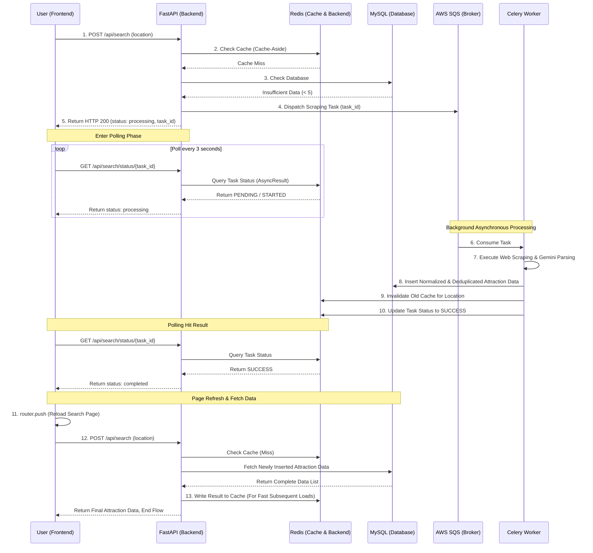

# Easy Travel Scheduler (一站式 AI 旅遊規劃網站)

整合 AI 應用與動態地圖的一站式旅遊規劃平台，讓使用者能在單一介面流暢完成景點收集、時間規劃與行程分享。

A one-stop travel platform integrating AI-driven parsing and dynamic maps, enabling users to seamlessly collect attractions, schedule itineraries, and share trips within a single interface.

[Live Demo](https://easy-travel-scheduler.linkuankuan.com/) | [API Documentation](https://easy-travel-scheduler.linkuankuan.com/docs)

## Test Account
| Account | Password | 
| ------ | ------ |
| test@mail.com | 12345678 |

## 🌟 核心功能
* **🔍 自動化推薦景點生成管線：** 整合搜尋引擎爬蟲、AI 語意萃取與非同步任務，打造旅遊數據收集系統：

  *  **搜尋目標網址：** 使用 **DuckDuckGo 搜尋引擎**，使用者輸入關鍵字，搜尋特定城市的「旅遊攻略」與「懶人包」。並設計過濾與篩選，確保取得高關聯性的目標網頁。

  *  **AI 語意解析與景點萃取：** 突破傳統依賴 DOM 結構的爬蟲限制，將目標網址匯入 **Gemini API (url_context tool)**，利用大型語言模型直接理解非結構化網頁內容，萃取推薦景點的名稱與描述，確保景點不存在「幻覺」。隨後串接 Google Places API 進行地點正規化、去重。

  *  **非同步任務：** 導入 Celery 處理高耗時的爬蟲與 AI 運算任務。採用 AWS SQS 作為高可靠性的訊息佇列 (Message Broker) 實現流量削峰，並搭配 Redis 作為結果儲存區 (Result Backend) 與狀態快取，徹底解決 API 阻塞問題。

* 🗺️ **動態地圖與路徑規劃 (Google Maps Platform)：**
整合多項 Google Maps 服務，打造流暢的行程規劃體驗：

  * Places API (Autocomplete)： 提供即時、精準的地點搜尋功能。

  * Maps JavaScript API： 渲染互動式地圖並結合景點資訊預覽面板（包含照片、地址與營業時間等細節），同時利用自訂地圖標記視覺化呈現每日行程的先後順序。

  * Routes API： 動態計算的交通路線，並精確估算已排定景點之間的移動時間與距離。

* ☁️ **雲端部署 & CI/CD:** 使用 Docker 將應用程式容器化，並透過 **GitHub Actions** 建置 CI/CD 流程，達成自動化部署至 AWS 雲端環境 (EC2/RDS)。

## 🌟 Core Features

* **🔍 Automated Attractions Generation Pipeline:**
  Integrated search engine web scraping, AI semantic extraction, and asynchronous task processing to build a robust travel data collection system:

  *  **Search target URL:** Utilized the **DuckDuckGo search engine** to programmatically fetch "travel guides" and "itineraries" with location where based on user-input keywords. Implemented filtering keyword to ensure the retrieval of highly relevant target web pages.

  *  **AI Semantic Parsing & Attraction Extraction:** Overcame the limitations of traditional DOM-dependent scrapers by feeding target URLs into the **Gemini API (url_context tool)**. Leveraged the LLM to directly understand unstructured web content, extracting recommended attraction names and descriptions, eliminating AI hallucinations. Subsequently integrated the Google Places API for location normalization, and deduplication.

  *  **Asynchronous Processing:** Implemented Celery to offload time-consuming web scraping and AI tasks. Leveraged **AWS SQS** as a highly reliable **Message Broker** for traffic leveling, paired with **Redis** as the **Result Backend** for state tracking, entirely eliminating API blocking.

* **🗺️ Dynamic Mapping & Routing (Google Maps Platform):**
  Integrated multiple Google Maps services to deliver a smooth planning experience:
  * **Places API (Autocomplete):** Provides real-time, accurate location search and location auto-completion.
  * **Maps JavaScript API:** Renders interactive maps integrated with preview panels for location details (photos, addresses, operating hours), and utilizes custom map pins to visualize the daily itinerary sequence.
  * **Routes API:** Dynamically calculates travel routes and estimates transit times and distances between scheduled spots.

* **☁️ Cloud Deployment & CI/CD:**
  Containerized applications using **Docker** and built a CI/CD pipeline via **GitHub Actions** for automated deployment to the **AWS** cloud environment (EC2/RDS).

## **Asynchronous Processing**

## Cloud System Architecture Diagram

## ERD

## 🛠️ Tech Stack

* **Frontend:** Next.js, React, TypeScript, CSS
* **Backend:** Python, FastAPI
* **Background Tasks & Cache:** Celery, AWS SQS, Redis
* **Database:** MySQL
* **AI & Third-Party APIs:** Google Gemini API, Google Maps Platform
* **DevOps:** Docker, AWS (EC2, RDS), GitHub Actions

## Screenshoot
* **Automated Attractions Generation Pipeline:**
  * input location

  * background task queues using **Celery, AWS SQS and Redis**

* **Dynamic Mapping & Routing (Google Maps Platform)**
  * **Places API (Autocomplete) & Maps JavaScript API:** 

  * **Routes API:**

  * **Maps JavaScript API:** 

